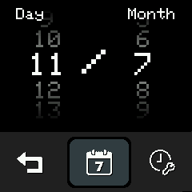
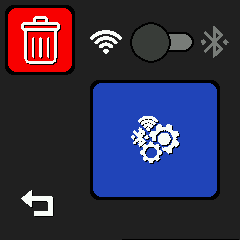
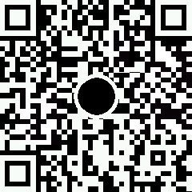
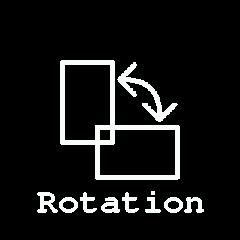
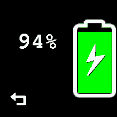
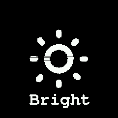
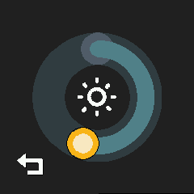
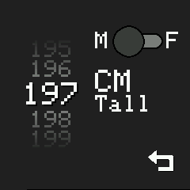

# Applications list:

## Set Date/Time
 * this app allow set time/date




## Timezone
 * this app allow set system timezone


## Provisioning
 * this app allow connect watch to internet via privisioning with a official ESP32 provisionning app from espressif
   * Android: https://play.google.com/store/apps/details?id=com.espressif.provsoftap 
 * Notes: at this time, only WiFi provisioning is availiable





## Screen orientation
 * Rotate whole screen




## Battery
 * Show battery health





## Settings
 * Enable disable features


## Brightness
 * Set default screen brightness





## Steps
 * Week activity stats 




* @TODO (more apps not listed here)

# Develop new application:

 * Duplicate files named:
  [src/app/ApplicationBase.hpp](ApplicationBase.hpp) & [src/app/ApplicationBase.cpp](ApplicationBase.cpp) set name at your discretion (recomended add "Application" at end)

 * Edit both files and change all references to "ApplicationBase" and change to "YourDesiredNameApplication"

 * your app is ready!
 
 ## Add to mainmenu (edit app/MainMenu.cpp)

 Include here #include "SomethingApplication.hpp" file on it

On the AllApps definition goes all MainMenu entries:

```{"PUT YOUR APP NAME HERE",img_mainmenu_debug_bits, img_mainmenu_debug_height, img_mainmenu_debug_width, [](void *caller) { LaunchApplication(new MYAPPLICATION()); } },```

and it's all... icons can be made with gimp (xbm format) img_mainmenu_debug_bits,img_mainmenu_debug_height and img_mainmenu_debug_width are inside a xbm file, create their own, with a max of 120x120px (isn't necesary to be squared,only at last 120px)

## How application works:

 * Applications on lWatch are objects descendants from TemplateApplication or LunokIoTApplication

 ***LunokIoTApplication*** is the base application (use it if don't want "back" button on your application)

 ***TemplateApplication*** is a LunokIoTApplication with back button (recommended)

::Tick() method are called from System, the app must draw their interface here (canvas)
  * return **true** means the UI has changed
  * return **false** means no redraw needed

 * To draw a splash screen must draw your canvas before leave Application constructor, If no splash use a "Tick();" at end of constructor

 * See [widgets to write a user interface](../UI/widgets/README.md)
